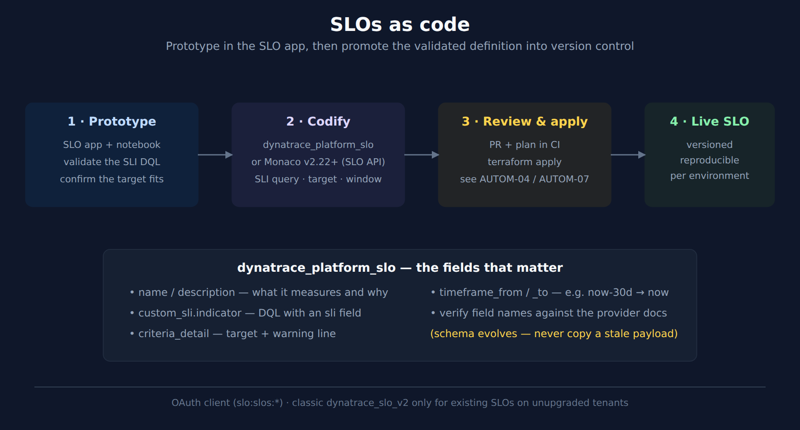

# SLO-05: SLOs as Code

> **Series:** SLO — Service Level Objectives | **Notebook:** 5 of 6 | **Created:** June 2026 | **Last Updated:** 09/28/2026

## Overview

A validated SLO that lives only in the UI is one accidental click from gone, and impossible to reproduce across environments. This notebook covers promoting SLOs into version control: the `dynatrace_platform_slo` Terraform resource and SLO Service Public API for the modern app, the classic `dynatrace_slo_v2`/`builtin:monitoring.slo` path it replaces (blocked at upgrade), the Monaco alternative, and the API path — with a deliberate emphasis on verifying field names at the source rather than copying a payload that may be stale.

---

## Table of Contents

1. [Why Version SLOs](#why)
2. [The Schema and Terraform Resource](#schema)
3. [Terraform Worked Example](#terraform)
4. [Monaco Alternative](#monaco)
5. [API and CI/CD](#api)

---

## Prerequisites

| Requirement | Details |
|-------------|---------|
| **Dynatrace Environment** | SaaS Gen3 with the SLO app |
| **Tooling** | Terraform with the `dynatrace-oss/dynatrace` provider, or Monaco |
| **Auth** | **OAuth client** (`DT_CLIENT_ID` / `DT_CLIENT_SECRET` / `DT_ACCOUNT_ID`) with `slo:slos:read` + `slo:slos:write` for `dynatrace_platform_slo`; a classic API token only if you still maintain `dynatrace_slo_v2` — see AUTOM-04 §3 |
| **Prior reading** | SLO-02 (the SLI query you will codify), AUTOM-04 / AUTOM-07 (provider auth, CI/CD) |

<a id="why"></a>
## 1. Why Version SLOs

SLOs are configuration, and configuration that matters belongs in source control:

- **Reproducible across environments** — the same SLO in dev, staging, and prod from one definition.
- **Reviewable** — a target change goes through a PR, not a quiet UI edit.
- **Recoverable** — an accidental deletion is a `terraform apply` away from restored.

The workflow mirrors AIOPS-02's stance on detectors: **prototype in the app, promote to code once it matters.**



<!-- MARKDOWN_TABLE_ALTERNATIVE
| Step | Action |
|------|--------|
| 1 Prototype | Validate the SLI DQL in the SLO app + a notebook |
| 2 Codify | dynatrace_platform_slo (Terraform) or the SLO Service API (Monaco v2.22+) — classic dynatrace_slo_v2 only for existing SLOs |
| 3 Review & apply | PR + plan in CI, terraform apply |
| 4 Live SLO | Versioned, reproducible per environment |
For environments where SVG doesn't render
-->

<a id="schema"></a>
## 2. The Schema and Terraform Resource

| Surface | Modern SLO app | SLO Classic |
|---------|----------------|-------------|
| API | **SLO Service Public API** | Service-level Objectives API classic (`/api/v2/slo`) — **blocked at upgrade** |
| Terraform resource | **`dynatrace_platform_slo`** (provider v1.78.0+; OAuth client with `slo:slos:read` / `slo:slos:write`) | `dynatrace_slo_v2` (classic `slo.*` + `settings.*` token scopes) |
| Monaco | `type: slo-v2` — supported since Monaco v2.22 (despite the name, this is the **modern** type, unrelated to the classic Terraform `dynatrace_slo_v2`) | `builtin:monitoring.slo` via `--settings-schema` — **blocked at upgrade** |
| Settings 2.0 schema | none — the SLO service is the store | `builtin:monitoring.slo` |

> **What "blocked at upgrade" rests on (checked 08/28/2026; quote re-read 09/28/2026).** The phrase is the **tenant upgrade readiness scan's** classification, read 07/31/2026 — not documentation. No Dynatrace page restates it; the published upgrade guidance is softer: *"An automated upgrade flow is under consideration; however, given the highly customized nature of SLOs, manual review is expected to yield the best results."* A readiness scan reporting what a tenant will not carry across and a docs page describing a manual migration are answering different questions, so they can both be right — but they imply different urgency. **Run the scan against your own tenant** before planning the work.

> **Corrected 07/31/2026.** This section previously presented `builtin:monitoring.slo` / `dynatrace_slo_v2` as *the* config-as-code path. They are the **classic** generation. `dynatrace_slo_v2` authenticates with classic `slo.read`/`slo.write` plus `settings.read`/`settings.write` and writes through `builtin:monitoring.slo`; the modern app has its own SLO Service Public API, reached by `dynatrace_platform_slo` with OAuth `slo:slos:*` scopes. The readiness scan flags both classic surfaces as blocked at upgrade, so codifying new SLOs as `dynatrace_slo_v2` puts them on a path that stops working. Verify argument names at the provider docs before writing HCL — the note below applies to `dynatrace_platform_slo` too.

**The DQL-SLI gap was a property of the classic resource, and `dynatrace_platform_slo` closes it.** `dynatrace_platform_slo` takes the SLI as a **DQL query** in `custom_sli.indicator` — the same query shape SLO-02 builds and the SLO app's Custom SLO uses, producing a timeseries field named `sli`. So the query you validated in a notebook goes into the HCL unchanged apart from the timeframe, which the SLO's `criteria` supplies. The classic `dynatrace_slo_v2` resource cannot do this: its SLI field (`metric_expression`) takes a **classic metric-selector expression** — e.g. `100*(builtin:service.requestCount.server:splitBy())/(...)` — so a span-ratio or log/bizevent-derived SLI (SLO-02's latency and custom examples) has no classic Terraform form at all. That is one more reason new SLOs belong on the modern resource.

> **Verify the exact argument names against the provider docs before you write HCL.** The provider schema evolves between releases, and copying a stale payload is precisely how the field-authored alerting document ended up with an SLO API body that would not apply. The modern example below follows the [`platform_slo` resource docs (Dynatrace GitHub)](https://github.com/dynatrace-oss/terraform-provider-dynatrace/blob/main/docs/resources/platform_slo.md) as read on 09/28/2026 (provider v1.105.0); the classic example follows the [`slo_v2` resource docs](https://registry.terraform.io/providers/dynatrace-oss/dynatrace/latest/docs/resources/slo_v2) as fetched on 07/01/2026. Treat both pages as authoritative going forward.

### Modern — `dynatrace_platform_slo` (use this for new SLOs)

Environment-wide request availability, using the SLO-02 availability SLI (live-validated there) with its `from:` / `interval:` removed — the SLO's `criteria` block owns the evaluation window:

```terraform
# dynatrace_platform_slo — schema read from the provider's resource docs 09/28/2026 (v1.105.0)
# Auth: OAuth client only — DT_CLIENT_ID / DT_CLIENT_SECRET / DT_ACCOUNT_ID,
# scopes slo:slos:read + slo:slos:write. A Platform Token does not drive this resource.
resource "dynatrace_platform_slo" "service_availability_30d" {
  name        = "Service Availability - 30d"
  description = "Request success ratio across services, rolling 30 days"
  tags        = ["team:platform", "tier:gold"]

  criteria {
    criteria_detail {
      target         = 99.5      # the goal (SLO-01 §4)
      warning        = 99.9      # early-warning line, above target
      timeframe_from = "now-30d" # rolling 30-day window
      timeframe_to   = "now"
    }
  }

  # The SLI is DQL. It must produce a timeseries field named `sli` (a percentage).
  # No from:/interval: here — the criteria block supplies the timeframe.
  custom_sli {
    indicator = <<-EOT
      timeseries {
        total    = sum(dt.service.request.count),
        failures = sum(dt.service.request.failure_count)
      }
      | fieldsAdd sli = ((total[] - failures[]) / total[]) * 100
      | fieldsRemove total, failures
    EOT
  }
}
```

### Classic — `dynatrace_slo_v2` (existing SLOs on unupgraded tenants only)

> **Dynatrace Classic.** Keep this form only to manage SLOs that already exist as `builtin:monitoring.slo` objects while your tenant is still on the classic surface — the readiness scan flags that schema as blocked at upgrade (see above). Do not author new SLOs this way; move existing ones to `dynatrace_platform_slo` as part of the upgrade.

```terraform
# dynatrace_slo_v2 — schema verified at the provider registry 07/01/2026
# Metric-based SLI (classic metric-selector syntax) — see the gap callout in Section 2
# regarding DQL-only SLIs, which this resource does not accept directly.
resource "dynatrace_slo_v2" "web_availability_30d" {
  name               = "Web Service Availability - 30d"
  custom_description = "Request success ratio for the critical web service, rolling 30 days"
  enabled            = true
  evaluation_type    = "AGGREGATE"

  # rolling 30-day window
  evaluation_window = "-30d"

  # entitySelector syntax (not a DQL filter) — scopes the SLO to web services
  filter = "type(SERVICE),serviceType(WEB_SERVICE,WEB_REQUEST_SERVICE)"

  # classic metric-selector expression — good / total as a percentage
  metric_expression = "100*(builtin:service.successCount:splitBy())/(builtin:service.requestCount:splitBy())"
  metric_name       = "web_availability_30d"

  target_success = 99.5
  target_warning = 99.9

  # required block — burn-rate visualization + optional fast-burn threshold (SLO-04)
  error_budget_burn_rate {
    burn_rate_visualization_enabled = true
    fast_burn_threshold             = 14
  }
}
```

<a id="terraform"></a>
## 3. Terraform Worked Example — Notes

**Modern resource (`dynatrace_platform_slo`):**

- **`criteria` → `criteria_detail`** carries `target` and `warning` (the goal and the early-warning line from SLO-01 §4) and the evaluation window as `timeframe_from` / `timeframe_to` (`now-30d` → `now` for a rolling 30 days). `criteria` is required; `criteria_detail` can repeat when you need more than one window.
- **`custom_sli.indicator`** is DQL and must yield a timeseries field named **`sli`**. Build and validate it in a notebook first (SLO-02), then paste it in without `from:` / `interval:`. The alternative, `sli_reference`, points at an SLI template instead of inlining a query.
- **Scope** with `custom_sli.filter_segments` — the SLO equivalent of applying a segment (ORGNZ) — or with a `filter` inside the DQL. An unscoped SLO measures the whole environment, which is rarely what you want outside an example.
- **Auth is an OAuth client, not a Platform Token.** The resource docs require `DT_CLIENT_ID` / `DT_CLIENT_SECRET` / `DT_ACCOUNT_ID` with `slo:slos:read` / `slo:slos:write`; see AUTOM-04 §3 for running it alongside Platform-Token resources in one provider block.
- **Export is opt-in** — name `dynatrace_platform_slo` explicitly when exporting (Section 5).

**Classic resource (`dynatrace_slo_v2`) — only while you still maintain classic SLOs:**

- **`target_success` and `target_warning`** are the goal and warning line (not the shorter `target`/`warning` the modern resource uses).
- **`metric_expression`** is a classic metric-selector string, not DQL — see the Section 2 gap.
- **`filter`** uses entitySelector syntax (`type(SERVICE),serviceType(...)`), not a DQL filter clause.
- **`error_budget_burn_rate` is a required block** — `fast_burn_threshold` inside it pairs with the SLO-04 burn-rate recipe.
- **Auth** is a classic API token (`slo.*` + `settings.*` scopes).

State handling follows the same rules as every other Dynatrace Terraform resource — see AUTOM-09 for state-backend setup.

<a id="monaco"></a>
## 4. Monaco Alternative

If your shop standardises on Monaco rather than Terraform, note first that **Monaco has supported the modern SLO Service Public API since v2.22** — prefer that over the classic settings object below, which targets the blocked `builtin:monitoring.slo` schema. The classic form is retained here because it is what existing Monaco projects contain, and because `monaco download` against it is how you inventory what needs moving:

```yaml
configs:
  - id: web-availability-30d
    type:
      settings:
        schema: builtin:monitoring.slo
        scope: environment
    config:
      template: web-availability-30d.json
      skip: false
```

The JSON template carries the SLI, target, warning, and window — and, unlike the Terraform resource, the Settings API payload behind a DQL-based Custom SLO (SLO-01 §3) is a first-class fit here, since Monaco pushes whatever JSON shape the schema accepts rather than mapping through the narrower Terraform resource attributes. As with Terraform, validate the SLI query in a notebook first, then export the working SLO from the app with `monaco download` to capture the exact current JSON shape rather than hand-writing it.

<a id="api"></a>
## 5. API and CI/CD

For direct API automation, use the **SLO Service Public API** — the modern app's own endpoint. This is not `/api/v2/slo`, which is the Service-level Objectives API *classic* and is flagged blocked at upgrade by the readiness scan; nor the older v1 SLO API. Rather than reproduce a request body that may drift, generate it from a working SLO:

1. Create and validate one SLO in the app.
2. Read it back via the API (or `monaco download` / `terraform-provider-dynatrace -export`) to capture the exact current schema.
   - **`dynatrace_platform_slo` will not appear in a default export.** Its resource documentation states: *"This resource is excluded by default in the export utility, please explicitly specify the resource to retrieve existing configuration."* Name it explicitly — `terraform-provider-dynatrace -export dynatrace_platform_slo` — or the step above returns nothing for exactly the resource you are trying to capture, which reads as "no SLOs are codified" rather than "this resource is opt-in".
3. Template that shape for the rest.

This "export a known-good object" approach is the antidote to stale-payload errors, and it is also the path of least resistance for a DQL-only SLI, since the classic resource's `metric_expression` field cannot carry one (Section 2) — on the modern resource it goes straight into `custom_sli.indicator`. For the full CI/CD pattern — plan on PR, gated apply, three-way validation — see AUTOM-07 (pipelines) and AUTOM-96 (GitHub Actions LAB); the SLO resource slots into exactly the same pipeline as any other Dynatrace config.

A codified SLO and a codified deployment gate are two different resources answering two different questions — see **SLO-06** for the `dynatrace_site_reliability_guardian` counterpart to everything in this notebook, including a guardian objective that references an SLO directly rather than duplicating its query.

> <sub>**Sources:** [Service-Level Objectives (DT docs)](https://docs.dynatrace.com/docs/deliver/service-level-objectives), [dynatrace_slo_v2 resource (Dynatrace provider docs)](https://registry.terraform.io/providers/dynatrace-oss/dynatrace/latest/docs/resources/slo_v2), [dynatrace_platform_slo resource (Dynatrace provider docs)](https://registry.terraform.io/providers/dynatrace-oss/dynatrace/latest/docs/resources/platform_slo) — the modern resource this section recommends: *"covers configuration for platform service-level objectives"*, Dynatrace SaaS only, OAuth **View SLOs** (`slo:slos:read`) / **Create and edit SLOs** (`slo:slos:write`), and *"This resource is excluded by default in the export utility, please explicitly specify the resource to retrieve existing configuration."*, [platform_slo.md (Dynatrace GitHub)](https://github.com/dynatrace-oss/terraform-provider-dynatrace/blob/main/docs/resources/platform_slo.md) — the same resource doc at its source; the registry page renders client-side, so it is the repository copy that makes the two quotes above machine-verifiable. [SLO Service Public API (DT docs)](https://docs.dynatrace.com/docs/dynatrace-api/environment-api/service-level-objectives) — endpoints are `/slos` and `/objective-templates`; the classic surface is documented separately as *Service-level Objectives API classic*, [Upgrade from Service-Level Objectives Classic (DT docs)](https://docs.dynatrace.com/docs/platform/upgrade/keep-problems-and-alerting-working/service-level-objective-upgrade-classic) — the version gates in §2, verbatim: *"Configuration as Code via Terraform overview support the SLO Service Public API since v1.78.0"* and *"Configuration as Code via Monaco overview supports the SLO Service Public API since v2.22."*, [Create service-level objectives (DT docs)](https://docs.dynatrace.com/docs/deliver/service-level-objectives/create-slo), [Monaco configuration (DT docs)](https://docs.dynatrace.com/docs/deliver/configuration-as-code/monaco). Terraform schema (`builtin:monitoring.slo`, `evaluation_window`, `target_success`/`target_warning`, required `error_budget_burn_rate` block) verified at the provider registry 07/01/2026; `dynatrace_platform_slo`'s schema (`criteria`/`criteria_detail`, `custom_sli.indicator`, `filter_segments`, `sli_reference`), OAuth scopes and export exclusion re-verified at source 09/28/2026 (provider v1.105.0). **Readiness scan:** the "blocked at upgrade" classification is from the tenant upgrade readiness scan, read 07/31/2026; re-checked 08/28/2026 against both upgrade pages and the API references, where it is not restated. **Derived:** the metric-expression-vs-DQL-sli gap in Section 2 combines the two resources' schemas (`metric_expression` vs `custom_sli.indicator`) with the Create-SLO docs' DQL `sli`-field description — no source states the gap explicitly.</sub>

---

<sub>*This notebook was AI-generated from community-submitted and publicly available sources. This notebook series is not officially supported by Dynatrace. Always verify information against official Dynatrace documentation.*</sub>
